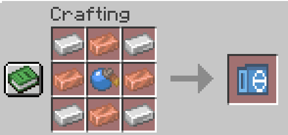

# Cobblemon Trainers

Mod Fabric qui ajoute des dresseurs Pokémon configurables à Cobblemon. Chaque dresseur est
un fichier JSON : une équipe au format Showdown, un skin - celui d'un compte Minecraft ou une
image livrée par le pack -, des dialogues dans la boîte de Cobblemon, une musique de combat,
et de quoi monter une progression - catégories, conditions à remplir pour être défié,
advancements à la victoire.
Les dresseurs se déclarent dans un datapack, donc sans toucher au code.

## Ce qui distingue ce mod

**Aucun dresseur n'apparaît naturellement.** C'est le choix de départ, et il n'y a pas de
réglage pour l'annuler : un monde ne se retrouve pas semé de dresseurs qui attendent dans le
vide, dans des biomes que personne ne traverse. Un dresseur n'existe que parce que quelqu'un
l'a voulu là - un administrateur ou le joueur lui-même.

**Côté administrateur**, deux façons de peupler un monde :

- `/cobblemontrainers spawn` pose un dresseur ici et maintenant, le temps d'un test ou d'un
  événement ;
- le **bloc de dresseur** lui donne un poste. Le bloc est invisible, retient quel dresseur
  invoquer, et le remet en place chaque fois qu'il manque à l'appel - tué, égaré, ou disparu
  avec un chunk. C'est ce qui tient un champion dans son arène ou le PNJ du spawn.

Et comme un bloc configuré **voyage dans une structure** avec ses réglages, il suffit d'en
poser un dans un bâtiment sauvegardé pour que chaque copie générée arrive avec *son* dresseur
déjà en place. Un village de dresseurs se construit une fois.

**Côté joueur, la façon de rencontrer un dresseur est complètement différente** : tout passe
par le **Battle Phone**, un objet, pas une commande.

Il se **craft**, à l'établi : quatre lingots de fer aux coins, quatre lingots de cuivre sur
les côtés, et une **noigrume bleue** au centre.

| | | |
| --- | --- | --- |
| Fer | Cuivre | Fer |
| Cuivre | **Noigrume bleue** | Cuivre |
| Fer | Cuivre | Fer |

<!-- Remplacer la ligne ci-dessous par l'image :  -->
*(image du craft à ajouter)*

Le joueur ouvre son Battle Phone, choisit un dresseur dans la liste, et l'appelle. Mais un
dresseur ne vient que **là où il a dit qu'il serait** : dans les mesas la nuit, sous un orage,
dans une structure, dans l'End. La fiche du dresseur affiche ce lieu, le bouton **Appeler**
est juste à côté, et si le joueur n'y est pas, le refus dit exactement ce qui manque. Trouver
un dresseur, c'est donc lire sa fiche puis aller au bon endroit - et le monde reste vide
jusque-là.

## Prérequis

| | Version |
| --- | --- |
| Minecraft | 1.21.1 |
| Fabric Loader | ≥ 0.17.2 |
| Java | 21 (exactement - Cobblemon refuse les autres) |
| Cobblemon | ≥ 1.7.3 |
| Fabric API | requis |
| Fabric Language Kotlin | requis |

## Installation

Place `cobblemon-trainers-<version>.jar` dans le dossier `mods/`, à côté de Cobblemon,
Fabric API et Fabric Language Kotlin. En solo, il n'y a rien de plus à faire.

**En multijoueur, le mod est requis des deux côtés** : le serveur et chaque joueur. Le Battle
Phone, l'écran du bloc de dresseur et la musique de combat sont des choses qu'un client doit
avoir pour en profiter - un client sans le mod se connecte, mais n'y a pas droit.

## Utilisation

Tout passe par une commande unique, `/cobblemontrainers`, et un verbe :

```
/cobblemontrainers spawn <id> [<x> <y> <z>]
/cobblemontrainers list [<joueur>]
/cobblemontrainers defeat <id|all> [<joueurs>] [reset]
/cobblemontrainers debugai
```

Niveau de permission 2 (opérateur), vérifié une fois sur la racine.

**➜ Le détail de chaque verbe est dans [docs/COMMANDS.md](docs/COMMANDS.md)** : les arguments,
les formes acceptées de l'ID, ce que chaque commande renvoie, et les messages d'erreur.

`debugai` est un interrupteur : tant qu'il est actif, chaque décision que le mod corrige chez
l'IA d'un dresseur est expliquée dans votre chat pendant le combat - coup refusé, changement
refusé, soin écarté, et pourquoi. Il sert à régler la difficulté d'un dresseur en le jouant.

L'autocomplétion de `spawn` propose les dresseurs chargés sous leur ID complet,
`<pack>:<dresseur>` - le namespace étant le pack d'où vient le dresseur, on voit d'un coup
d'œil qui fournit quoi. À la frappe, le nom seul suffit quand il n'est pas ambigu, et la
recherche porte sur les deux moitiés : `jac` retrouve `mon_pack:jacinthe`.

`list` liste les dresseurs à battre et coche ceux qui l'ont été, pour soi ou pour un autre
joueur. Les joueurs, eux, ont le **Battle Phone** - voir plus bas.

`defeat` inscrit une victoire sans combat : le dresseur compte comme vaincu, les advancements
sont évalués et les dresseurs verrouillés derrière lui s'ouvrent. De quoi tester une ligue
entière sans la jouer, et `all` la coche d'un coup pour tous les dresseurs chargés. Il ne
remet **pas** les récompenses, pour qu'on puisse le relancer autant qu'on veut. `reset` fait
l'inverse et oublie la victoire - mais ne retire pas un advancement déjà obtenu, ce qui reste
l'affaire de `/advancement revoke`.

Un clic droit sur le dresseur lance le combat, sur fond de musique de combat. Si le combat
ne peut pas démarrer (pas de Pokémon dans ton équipe, combat déjà en cours, dresseur sans
équipe, dresseur qui ne prend pas de revanche, ou conditions non remplies), la raison
s'affiche dans le chat.

Le combat s'ouvre sur le **Pokémon sélectionné dans la barre d'équipe**, pas sur le premier
slot : celui qui est en surbrillance dans l'overlay, ou à défaut celui qui est sorti à côté du
joueur. Un Pokémon K.O. est ignoré et le premier disponible entre à sa place.

Tuer ou supprimer un dresseur pendant le combat met fin à la rencontre au lieu de laisser le
joueur enfermé face à un adversaire absent.

### Les dresseurs livrés avec le mod

Le mod apporte **huit dresseurs**, dans le namespace `cobblemon-trainers` : des *dresseurs
iconiques* niveau 80, chacun appelable depuis un biome donné, et un dernier verrouillé
derrière l'un d'eux, niveau 100, qui ne répond que dans l'End. Ils apparaissent dans le Battle
Phone sous leur propre onglet, à côté de ceux de tes packs, et servent d'exemple jouable de ce
que le format permet.

## Le Battle Phone

`/cobblemontrainers list` est réservé aux opérateurs. Le **Battle Phone**
(`cobblemon-trainers:battle_phone`) est la même chose pour tout le monde : un clic droit et
l'écran liste les dresseurs du monde, le skin de chacun, et dit lesquels sont déjà vaincus.

Les dresseurs sont **triés par datapack** : les flèches en haut de la liste (ou les touches
gauche et droite) passent d'un pack à l'autre, avec un onglet « tous les datapacks » en
premier dès qu'il y en a plusieurs - celui-là sépare les packs par un intertitre. À
l'intérieur d'un pack, un intertitre par **catégorie** - le dossier où le pack range ses
dresseurs -, chacun avec son propre compteur.

Cliquer une ligne montre le dresseur en entier à droite, avec son niveau, la taille de son
équipe et son état - vaincu, vaincu sans revanche possible, encore debout, ou fermé tant que
ses conditions ne sont pas remplies, auquel cas la liste de ce qui manque remplace son
équipe. À côté de lui, ce que le battre rapporte : une case par objet, avec sa quantité, et
au-delà de quatre la dernière case compte le reste et le nomme au survol. Contrairement à son
équipe, les récompenses sont visibles avant de l'avoir battu - c'est ce qui donne envie
d'essayer -, et un pack peut en garder une secrète avec `"hidden": true`. Une récompense qui
ne tombe qu'à la première victoire porte un marqueur, et son icône est grisée une fois
réclamée. À côté, six cases pour son équipe : elles restent fermées jusqu'à la victoire, puis
affichent les modèles de ses Pokémon, formes et chromatiques comprises. Passer la souris sur
l'une d'elles donne le nom et le niveau du Pokémon.

L'objet ne retient rien : il lit la progression du serveur, donc deux exemplaires affichent
la même chose et le perdre ne perd rien. Il se craft avec du fer, du cuivre et une noigrume
bleue - voir [le craft](#ce-qui-distingue-ce-mod) -, se trouve dans l'onglet créatif
**Cobblemon Trainers**, ou s'obtient avec :

```
/give @s cobblemon-trainers:battle_phone
```

Seuls les dresseurs en `"listed": true` y apparaissent, comme dans `/cobblemontrainers list`,
et un dresseur verrouillé peut se cacher entièrement jusqu'à ce que ses conditions soient
remplies - voir [docs/DATAPACK.md](docs/DATAPACK.md#le-suivi-de-progression).

### Appeler un dresseur

Un dresseur qui déclare **où il se trouve** est appelable depuis sa fiche : le Battle Phone
affiche son lieu, et un bouton **Appeler** le fait venir à quelques dizaines de blocs quand le
joueur y est. Un dresseur qui ne déclare rien - un champion dans son arène - n'a pas de bouton
et se trouve à pied.

Un joueur ne peut avoir qu'un seul dresseur appelé à la fois, et un dresseur verrouillé n'est
jamais appelable. Le combat se lance toujours au clic droit sur le dresseur.

**➜ Tout ça est dans [docs/SPAWNING.md](docs/SPAWNING.md)** : le bloc `location`, ses
conditions, ses textes, et ce que fait le mod autour.

## Le bloc de dresseur

Un dresseur invoqué par `/cobblemontrainers spawn` disparaît quand on le tue. Pour un dresseur
qui doit tenir un poste - un champion d'arène, le PNJ du spawn -, il y a le **bloc de dresseur**
(`cobblemon-trainers:trainer_spawner`) : il retient quel dresseur invoquer, et le remet
toujours en place.

Le bloc est **invisible**, exactement comme une barrière : il n'apparaît que si on tient son
item en main, sous forme de marqueurs sur chaque bloc de dresseur des environs. On le trouve
dans l'onglet créatif **Cobblemon Trainers**, ou avec :

```
/give @s cobblemon-trainers:trainer_spawner
```

C'est un bloc d'opérateur, au même titre qu'un bloc de commande : **tout ce qu'il fait demande
d'être opérateur *et* en créatif**. Sans ça, l'item ne pose rien, le bloc ne se casse pas, les
marqueurs n'apparaissent pas même l'item en main, le curseur traverse le bloc sans l'accrocher,
et le clic droit n'ouvre rien.

> L'onglet créatif, lui, est visible par tous. Le cacher n'était possible qu'en le liant au
> réglage vanilla *Onglet d'objets d'opérateur*, désactivé par défaut - il aurait disparu pour
> les opérateurs eux-mêmes. Un item inerte dans un inventaire créatif est le moindre mal.

Pose le bloc là où le dresseur doit se tenir - il n'a pas de collision, le dresseur se tient
dedans - puis fais un **clic droit** dessus. Il faut le mod installé côté client pour que
l'écran s'ouvre.

L'écran qui s'ouvre reprend celui du bloc de commande :

| Champ | Ce qu'il fait |
| --- | --- |
| **Dresseur** | L'ID du dresseur à invoquer. La liste en dessous montre les dresseurs chargés : cliquer sur l'un d'eux remplit le champ, et taper dedans filtre la liste. Un champ vide éteint le bloc. |
| **Rayon de retour** | Distance au-delà de laquelle le dresseur est ramené sur son bloc. 12 blocs par défaut, de 1 à 64. |
| **Délai de réapparition** | Temps d'attente avant qu'un dresseur tué revienne. 30 secondes par défaut, 0 pour un retour immédiat. |

*Entrée* ou *Terminé* valide, *Échap* ou *Annuler* ferme sans rien changer. L'ID accepte la
forme complète `<pack>:<dresseur>` comme le nom seul, comme `/cobblemontrainers spawn`.

Ensuite le bloc se débrouille :

- il invoque son dresseur dès qu'il est réglé, et le remet en place chaque fois qu'il manque
  à l'appel ;
- un dresseur tué revient après le délai ;
- un dresseur qui s'éloigne trop est ramené sur son bloc, sa propre vie remise au maximum
  comme s'il venait d'être invoqué - sauf s'il est en plein combat, où il est laissé
  tranquille jusqu'à la fin. Son équipe n'est pas touchée : le report des dégâts d'un combat
  au suivant reste réglé par `battle.healParty` ;
- casser le bloc emporte son dresseur. Comme une barrière, il ne se casse qu'en créatif et ne
  se ramasse pas ;
- le dresseur regarde vers le joueur qui a posé le bloc, et suit ensuite l'orientation de
  celui-ci.

Un dresseur qui refuse la revanche (`"rematch": "never"`) ou dont les conditions ne sont pas
remplies reste debout sur son bloc et décline poliment : ce qu'un joueur a accompli est retenu
par ID de dresseur, pas par entité.

### Dans une structure

Un bloc configuré garde ses réglages quand il part dans une structure : sauvegarde un bâtiment
avec son bloc de dresseur dedans, et chaque copie posée sort réglée sur le même dresseur, même
rayon, même délai - et invoque *son* dresseur, pas celui de l'original. Ça vaut pour le bloc
de structure comme pour `/structure`, et donc aussi pour une structure générée par datapack.

L'orientation suit la structure : pose-la tournée d'un quart de tour ou en miroir, le dresseur
regarde dans la direction correspondante. Comme un four ou un lit, le bloc n'a que quatre
directions - il s'oriente vers celui qui le pose.

## Déclarer un dresseur

Les dresseurs se déclarent dans un datapack, à
`data/<namespace>/cobblemontrainers/<chemin>.json`. L'ID est `<namespace>:<chemin>`, le
dossier compris - et ce dossier est aussi la **catégorie** du dresseur. `/reload` recharge le
tout sans redémarrer.

```json
{
  "name": "Red",
  "skin": { "type": "player_username", "value": "Red" },
  "battle": { "level": 88, "difficulty": 5 },
  "messages": { "greeting": "On se défie ?", "win": "C'est terminé !" },
  "team": [
    "Pikachu (M) @ Light Ball
Ability: Static
Level: 88
Shiny: Yes
Timid Nature
- Thunderbolt
- Iron Tail"
  ]
}
```

Tous les champs sont facultatifs, et chacun vit dans le bloc qui le concerne : `battle` pour
le combat (format, difficulté, soin de l'équipe, musique), `messages` pour ce que le dresseur
dit, `progress` pour ce que le battre change, `rewards` pour ce qu'on y gagne.

Un clic droit sur un dresseur ouvre la boîte de dialogue de Cobblemon - la même que celle de
leurs NPC : le dresseur salue, propose Combattre ou Annuler, et dit son mot une fois le combat
fini. Ce sont les cinq `messages`, et aucun n'est obligatoire.

Ce qu'un joueur a accompli est retenu par ID de dresseur : battre un exemplaire de
`mon_pack:champion` les bat tous, et le réinvoquer ne remet pas le compteur à zéro. C'est ce
que lisent `"rematch": "never"` (une seule rencontre) et, sur une récompense,
`"firstWinOnly": true` (un butin qui ne retombe pas). Les deux se combinent : un même combat
rejouable peut donner un trophée une fois et du consommable à chaque victoire.

**C'est là tout l'intérêt des récompenses** : un dresseur rejouable est une *méthode de farm*,
et c'est le datapack qui décide laquelle. Un dresseur qui rend des baies à chaque victoire est
une plantation qui se joue au lieu de s'attendre ; un autre peut rendre un minerai, une
ressource qu'on n'obtient pas autrement, ou de quoi avancer dans une progression. Le mod ne
livre aucune de ces boucles - il livre le crochet, et les packs à venir en feront ce qu'ils
voudront.

Un bloc `requires` ferme un dresseur tant qu'un joueur n'a pas battu tel autre dresseur,
gagné tant de combats, obtenu tel advancement ou tel objet, ou n'a pas tel Pokémon dans son
équipe - de quoi monter une ligue à badges. Et battre un dresseur déclenche le critère `cobblemon-trainers:trainer_defeated`, sur
lequel un pack branche ses propres advancements.

`/cobblemontrainers list` liste les dresseurs restants et ceux déjà vaincus, groupés par
catégorie. Un dresseur qui n'a rien à y faire - démonstration, dresseur jamais invoqué - se
retire de la liste avec `"listed": false`.

Une forme - régionale, méga, fakemon d'un autre pack - s'obtient avec une ligne `Aspects:`,
qui reprend la syntaxe de `/pokespawn` : `"Aspects: rlm, poison"` pour un Haxorus RLM Poison.

Un dresseur ne se promène jamais, mais il **tourne la tête vers le joueur qui s'approche** -
à huit blocs, comme un villageois. Rien à régler : c'est le cas de tous les dresseurs, qu'ils
soient posés par un bloc, invoqués en commande ou appelés depuis le Battle Phone.

**➜ Toute la documentation est indexée dans [docs/README.md](docs/README.md)**, qui dit
quelle page répond à quelle question - et sa traduction anglaise dans
[docs/en/](docs/en/README.md).

**➜ Le guide complet est dans [docs/DATAPACK.md](docs/DATAPACK.md)** : arborescence,
référence de tous les champs, catégories, conditions, advancements, format d'équipe Showdown,
skins, musique, revanches et récompenses, traductions, et les erreurs fréquentes.

**➜ Ce que fait chaque niveau d'IA est dans [docs/DIFFICULTE.md](docs/DIFFICULTE.md)** :
le comportement exact de `battle.difficulty`, de `0` à `5`.

**➜ Comment un dresseur se fait appeler est dans [docs/SPAWNING.md](docs/SPAWNING.md)** :
le bloc `location` et tout ce qui l'entoure.

**➜ Faire méga-évoluer un dresseur est dans [docs/GIMMICKS.md](docs/GIMMICKS.md)** :
`battle.gimmicks`, la gemme à lui donner et l'objet de repli. Ça demande
[Cobblemon: Mega Showdown](https://modrinth.com/mod/mega-showdown), qui reste **facultatif** -
sans lui, le mod se charge et se joue comme avant.

Un pack d'exemple couvrant chaque option vit dans
[`examples/cobblemonrlm/`](examples/cobblemonrlm) : un seul dossier qui fait à la fois
datapack (`data/`) et resource pack (`assets/`). Il est aussi **téléchargeable prêt à
l'emploi** : chaque [release](https://github.com/matheo-1712/cobblemon-trainers/releases)
l'attache à côté du jar sous le nom `exemple_trainer_datapack.zip`. À déposer tel quel dans
`mods/`, `datapacks/` ou `resourcepacks/` - rien à dézipper.

Trois façons de livrer un pack, au choix de son auteur :

| Voie | Emplacement | Formats | Charge |
| --- | --- | --- | --- |
| Dossier des mods | `mods/` | dossier, `.zip`, `.jar` | `data/` **et** `assets/` |
| Datapack | `saves/<monde>/datapacks/`, `world/datapacks/` | dossier, `.zip`, `.jar` | `data/` |
| Resource pack | `resourcepacks/` | dossier, `.zip`, `.jar` | `assets/` |

Deux ajouts du mod par rapport à Minecraft : le `.jar` est accepté partout (le jeu ne connaît
que le dossier et le `.zip`), et surtout **un pack posé dans `mods/` est lu tel quel, avec son
seul `pack.mcmeta`** - sans `fabric.mod.json`, sans code. C'est la seule voie qui charge d'un
coup les dresseurs et leurs traductions et musique, en un fichier que le joueur dépose sans
rien cocher.

Le dossier `datapacks/` d'un monde, lui, ne lit que `data/`, jamais `assets/`. Le détail et
les pièges sont dans [docs/DATAPACK.md](docs/DATAPACK.md#où-poser-le-pack).

## Développement

```bash
./gradlew build
```

Le jar remappé sort dans `build/libs/`. Pour lancer un environnement de test :

```bash
./gradlew runClient
```

Le projet cible Java 21 via un toolchain Gradle, ce qui force aussi `runClient` et
`runServer` - sans ça, Cobblemon refuse de démarrer sous un JDK plus récent. Ne place pas
de jar Cobblemon dans `run/mods/` : il est déjà fourni par les dépendances, et le doublon
fait planter le client.

Les versions de Cobblemon et Architectury sont des **ID de version Modrinth** dans
`gradle.properties`, pas des numéros. Un ID ne dit rien de la version de jeu qu'il cible,
donc vérifie-le avant de le changer :

```bash
curl -s "https://api.modrinth.com/v2/version/<ID>" | python -c "import sys,json;v=json.load(sys.stdin);print(v['version_number'],v['loaders'],v['game_versions'])"
```

Voir aussi la [documentation Fabric](https://docs.fabricmc.net/develop/getting-started/creating-a-project#setting-up)
pour la configuration de l'IDE.

### Publier une release

Publier une release GitHub dont le tag est `v<version>`, par exemple `v1.2.3`. Le workflow
`release.yml` construit, publie sur Modrinth, et attache à la release le jar et
`exemple_trainer_datapack.zip` - le pack d'exemple, prêt à poser dans `mods/`, `datapacks/` ou
`resourcepacks/`.

C'est le tag qui donne la version du mod : rien à mettre à jour avant de tagguer, le `version=`
de `gradle.properties` n'est que le défaut des builds locaux. Le corps de la release sert de
changelog, et la case *pre-release* publie en beta.

Le workflow pousse aussi `MODRINTH.md` par-dessus la description du projet Modrinth, à chaque
release : la page de la boutique ne peut donc pas décrire une version antérieure.

Un seul secret attendu par le dépôt : `MODRINTH_TOKEN`. En local, `./gradlew publishMods` est
sans risque : sans jeton, il écrit ce qu'il aurait envoyé dans `build/mod-publish/`.

## Limites connues

- Les formes se déclarent par leurs aspects (`Aspects: rlm, poison`), pas par le suffixe
  Showdown du nom d'espèce (`Raichu-Alola`), qui ne se distingue pas des espèces dont le nom
  contient un tiret (`Ho-Oh`, `Porygon-Z`).
- Les skins `player_username` et `player_uuid` sont récupérés depuis l'API Mojang : ils
  nécessitent un accès réseau et un pseudo existant. En cas d'échec, le dresseur garde le
  skin par défaut et la raison est écrite dans les logs. Le type `texture`, lui, n'a besoin
  de rien d'autre que d'une image dans le pack.
- La musique de combat n'est jouée que pour un joueur qui a le mod : c'est son client qui la
  fait tourner, ce qui est aussi ce qui la fait boucler et qui met la musique du jeu en
  attente le temps du combat.

## Licence

CC0-1.0 - voir [LICENSE](LICENSE).
